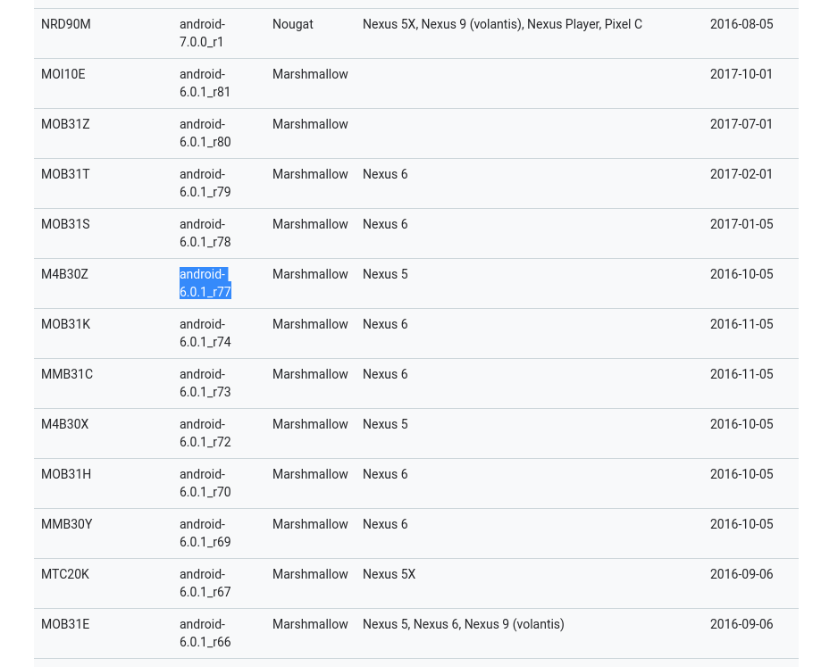

# 国内下载Nexus5的android6.0源码

__作者:seekting__

##  一.下载 repo

### 1.1 通过curl下载

```shell
curl https://mirrors.tuna.tsinghua.edu.cn/git/git-repo -o repo
chmod +x repo
```

### 1.2 通过百度云下载

也可以通过百度云下载

链接: https://pan.baidu.com/s/1iNp7gmjUWB-3SzoAZdzC8A 提取码: mm3q 

## 二. 初始化repo

把repo放到~/bin目录下

因为走的是国内镜像源码服务器，所以要修改url

```shell
REPO_URL = 'https://aosp.tuna.tsinghua.edu.cn/git-repo'
```

## 三. android对应版本

https://source.android.com/setup/start/build-numbers#source-code-tags-and-builds	



## 四. 初始化代码库

```
repo init -u https://aosp.tuna.tsinghua.edu.cn/platform/manifest -b android-6.0.1_r77
```

## 五. 下载

```shell
repo sync
```


