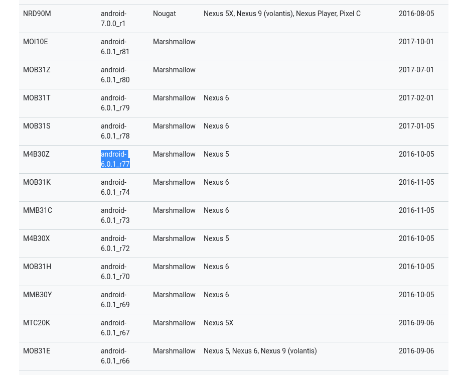
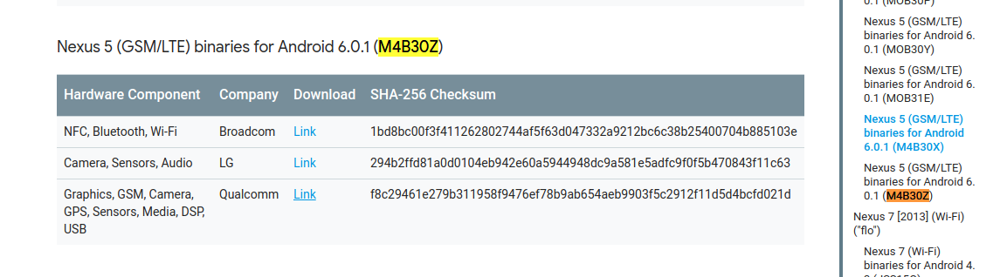

# ubuntu 16.04编译android6.0源码

> 作者:seekting

## 一. 安装配置java环境

### 1.1 安装openJDK7.0

```shell
sudo add-apt-repository ppa:openjdk-r/ppa
sudo apt-get update
sudo apt-get install openjdk-7-jdk
```

### 1.2 配置JAVA环境

打开～/.bashrc

```shell
export JAVA_HOME=/usr/lib/jvm/java-7-openjdk-amd64
export JRE_HOME=${JAVA_HOME}/jre 
export CLASSPATH=.:${JAVA_HOME}/lib:${JRE_HOME}/lib 
export PATH=${JAVA_HOME}/bin:$PATH
```

如果系统里装了多个openJdk版本，可以指定JAVA_HOME为java7

```shell
#export JAVA_HOME=/usr/local/java/jdk1.8.0_181
export JAVA_HOME=/usr/lib/jvm/java-7-openjdk-amd64
export JRE_HOME=${JAVA_HOME}/jre 
export CLASSPATH=.:${JAVA_HOME}/lib:${JRE_HOME}/lib 
export PATH=${JAVA_HOME}/bin:$PATH
```

查看java7版本 
```shell
java -version
java version "1.7.0_95"
OpenJDK Runtime Environment (IcedTea 2.6.4) (7u95-2.6.4-3)
OpenJDK 64-Bit Server VM (build 24.95-b01, mixed mode)

```

## 二. 添加库依赖

```shell
sudo apt-get install -y git flex bison gperf build-essential libncurses5-dev:i386 
sudo apt-get install libx11-dev:i386 libreadline6-dev:i386 libgl1-mesa-dev g++-multilib 
sudo apt-get install tofrodos python-markdown libxml2-utils xsltproc zlib1g-dev:i386 
sudo apt-get install dpkg-dev libsdl1.2-dev libesd0-dev
sudo apt-get install git-core gnupg flex bison gperf build-essential  
sudo apt-get install zip curl zlib1g-dev gcc-multilib g++-multilib 
sudo apt-get install lib32z-dev ccache
sudo apt-get install libgl1-mesa-dev libxml2-utils xsltproc unzip m4
sudo zip curl zlib1g-dev gcc-multilib g++-multilib libc6-dev-i386 
sudo lib32ncurses5-dev x11proto-core-dev libx11-dev lib32z-dev ccache
```


## 三. 驱动

### 3.1 驱动下载

上一课用的是6.0.1_r77分支，所以它的代号是M4B30Z



打开 [https://developers.google.com/android/drivers](https://developers.google.com/android/drivers)，找到M4B30Z的driver



下载这三个link

```shell
├── broadcom-hammerhead-m4b30z-21cf8433.tgz
├── lge-hammerhead-m4b30z-520d054d.tgz
└── qcom-hammerhead-m4b30z-d6c0fe26.tgz
```

### 3.2 驱动解压

解压这三个文件

```shell
tar xvf broadcom-hammerhead-m4b30z-21cf8433.tgz 
tar xvf lge-hammerhead-m4b30z-520d054d.tgz
tar xvf qcom-hammerhead-m4b30z-d6c0fe26.tgz 
```

得到三个.sh文件

```shell
├── extract-broadcom-hammerhead.sh
├── extract-lge-hammerhead.sh
├── extract-qcom-hammerhead.sh
```

### 3.3 把驱动放入源码

把vendor目录copy到源码的根目录
```shell
mv vendor ~/work/sources/android6.0_r77
```

## 四. 编译
```shell
#初始化环境
source ./build/envsetup.sh
#选择hammerhead-userdebug
lunch aosp_hammerhead-userdebug
#编译并保存日志
make -j8 > make-j8.log
```
遇到的错误
```shell
build/core/host_shared_library_internal.mk:51: recipe for target 'out/host/linux-x86/obj/lib/libart.so' failed
```

解决方法： 
编译之前建议先修改源码文件里的此文件：art/build/Android.common_build.mk里的内容 
```shell
ART_HOST_CLANG := false 
ifneq ($(WITHOUT_HOST_CLANG),true) 
# By default, host builds use clang for better warnings. 
ART_HOST_CLANG := true 
endif
```
修改为
```shell
ART_HOST_CLANG := false 
ifeq ($(WITHOUT_HOST_CLANG),false) 
# By default, host builds use clang for better warnings. 
ART_HOST_CLANG := true 
endif
```

## 五. 刷机


```shell
seekting@seekting-home:~/work/sources/android6.0_r77$ adb reboot bootloader
seekting@seekting-home:~/work/sources/android6.0_r77$ fastboot flashall -w

```

